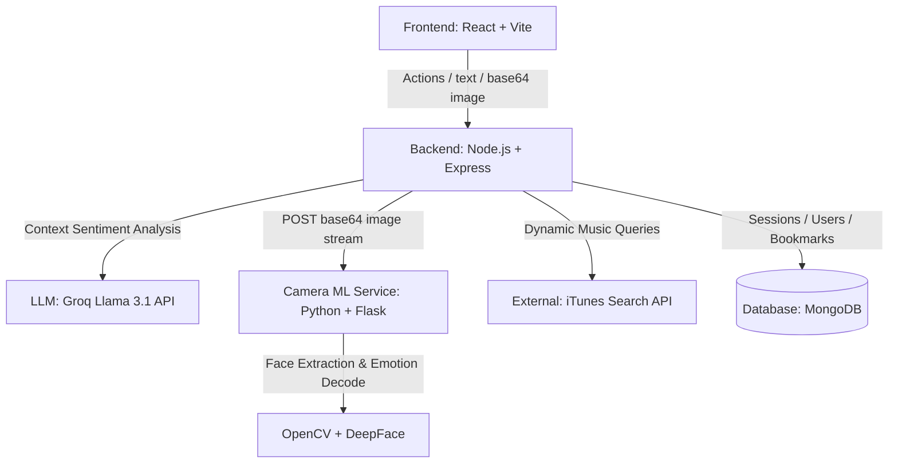

# Melody: Premium Mood-to-Music Engine

Melody is a premium full-stack emotional intelligence application that maps your current feelings—either through real-time facial expressions via webcam or conversation sentiment markers—and instantly synchronizes a highly matching music playlist. 

---

## 1. Project Overview

Melody provides a premium user experience to help users discover music that resonates with their emotional frequency. It supports three distinct emotion detection modalities:
*   **Quick Select**: Immediate, manual mood settings spanning 12 specialized emotional states.
*   **AI Analysis**: Natural language conversation sentiment analysis using Groq-powered Llama 3.1.
*   **Face Scan**: Computer vision facial expression categorization using OpenCV and DeepFace.
*   **Hybrid Scan**: Fuses conversation context and facial expression biometrics to classify a unified emotional presence.

---

## 2. System Architecture

Melody utilizes an event-driven, decoupled microservices architecture with a responsive React frontend, an Express gateway backend, a Python Flask computer vision node, and MongoDB storage.



---

## 3. Technology Stack

*   **Frontend**: React (v19), React Router DOM (v7), Tailwind CSS, Framer Motion, and Three.js (for immersive neon WebGL canvases and interactive elements).
*   **Backend**: Node.js, Express, Mongoose, Axios, Cors, and JWT authentication.
*   **Computer Vision Service**: Python (v3.9 - v3.11), Flask, OpenCV (for frame parsing), and DeepFace (for expression classification).
*   **LLM (Large Language Model)**: Groq SDK utilizing `llama-3.1-8b-instant` for deterministic JSON sentiment classification.
*   **Database**: MongoDB (for session logs, credentials, and liked song bookmarks).
*   **External APIs**: iTunes Search API (for dynamic, location-agnostic music recommendation queries).

---

## 4. Installation & Setup

Please follow the installation and startup instructions in the exact order detailed below:

### Step 1: Start MongoDB
Ensure that MongoDB is running locally on your machine on the default port:
```bash
mongodb://localhost:27017/mood_to_music
```
Alternatively, set up a MongoDB Atlas cloud database cluster.

### Step 2: Set Up and Run the Flask ML Service
1.  Navigate to the `ml` directory:
    ```bash
    cd ml
    ```
2.  Create and activate a virtual environment:
    *   **Windows**:
        ```powershell
        python -m venv venv
        .\venv\Scripts\Activate.ps1
        ```
    *   **macOS/Linux**:
        ```bash
        python3 -m venv venv
        source venv/bin/activate
        ```
3.  Install dependencies:
    ```bash
    pip install -r requirements.txt
    ```
4.  Run the server on port `5001`:
    ```bash
    python run.py
    ```

### Step 3: Set Up and Run the Node.js Backend
1.  Navigate to the `backend` directory:
    ```bash
    cd backend
    ```
2.  Install packages:
    ```bash
    npm install
    ```
3.  Configure the environment variables in a `.env` file (see details below).
4.  Launch the development server on port `5000`:
    ```bash
    npm run dev
    ```

### Step 4: Set Up and Run the React Frontend
1.  Navigate to the `frontend` directory:
    ```bash
    cd frontend
    ```
2.  Install packages:
    ```bash
    npm install
    ```
3.  Launch the Vite developer client:
    ```bash
    npm run dev
    ```
4.  Open `http://localhost:5173` in your browser.

---

## 5. Environment Variables

### Backend Configuration (`backend/.env`)
Create a `.env` file in the `backend/` directory:
```env
# Port configuration (typically set automatically in production)
PORT=5000

# MongoDB Connection String (Community Edition or Atlas URI)
MONGO_URI=mongodb://localhost:27017/mood_to_music

# JWT Authentication Secret key
JWT_SECRET=your_jwt_secret_key_here

# Groq Cloud API Key (for Llama 3.1 NLU engine)
GROQ_API_KEY=gsk_your_groq_api_key_here

# Flask ML Service endpoint URL (e.g. Render app URL)
ML_SERVICE_URL=http://localhost:5001

# Production frontend domain (used for secure CORS restrictions)
FRONTEND_URL=http://localhost:5173
```

### Frontend Configuration (`frontend/.env`)
Vite uses these environment variables for backend routing:
```env
# Primary API endpoint URL (e.g., https://your-backend.onrender.com/api)
VITE_API_URL=http://localhost:5000/api

# Fallback API endpoint URL
VITE_API_BASE_URL=http://localhost:5000/api
```

---

## 6. Production Deployment

Melody is designed to be deployed as three independent services:

### A. Frontend (Vercel)
1. Link your repository to **Vercel**.
2. Set the build command to `npm run build` and output directory to `dist`.
3. Configure the following environment variable:
   * `VITE_API_URL`: The URL of your deployed Backend service (e.g. `https://melody-backend.onrender.com/api`).

### B. Backend (Render Web Service)
1. Create a new **Web Service** on **Render** linked to your repository directory `/backend`.
2. Select **Node** runtime.
3. Configure the following environment variables:
   * `MONGO_URI`: Your MongoDB Atlas URI.
   * `JWT_SECRET`: A secure random secret key.
   * `GROQ_API_KEY`: Your Groq API token.
   * `ML_SERVICE_URL`: The URL of your deployed ML Service (e.g. `https://melody-ml.onrender.com`).
   * `FRONTEND_URL`: Your Vercel frontend URL (e.g. `https://melody.vercel.app`) to restrict CORS access safely.

### C. ML Service (Render Web Service)
1. Create a new **Web Service** on **Render** linked to your repository directory `/ml`.
2. Select **Python** runtime. Set the build command to `pip install -r requirements.txt` and start command to `gunicorn run:app` or `python run.py`.
3. Set the `PORT` env var (handled automatically by Render).

### D. Communication Flow
```
Browser ──(HTTPS/WSS)──> Frontend (Vercel) ──(API Requests)──> Backend (Render) ──(Server-to-Server JSON POSTs)──> ML Service (Render)
```
*Note: The browser never communicates directly with the ML microservice, keeping facial base64 frame data flows securely encapsulated inside server-to-server networks.*

---

## 7. Key Features

1.  **Dynamic Music Synchronizer**: iTunes Search API integration fetches real-time songs corresponding to your current vibe. Cards link directly to Apple Music.
2.  **Context-Aware Chat Analyzer**: Maintains a sliding context window of the user's latest conversation entries to map cumulative mood shifts.
3.  **Face Expression Scanner**: Captures facial biometrics via live webcam or static file upload (PNG/JPG/WEBP), resolving blank frame false-positives natively.
4.  **Hybrid Sentiment Fusion**: Fuses webcam biometrics and chat context for highly precise multidimensional emotional mapping.
5.  **Personal Insights Dashboard**: Interactive timeline logs with pagination, search, date range, source, and mood filters.
6.  **Listening Analytics**: Displays interactive SVG bar distribution graphs (Weekly/Monthly), AI-derived behavioral summaries, top recommended artists, and favorite genres.
7.  **Loved Track Bookmarks**: Allows users to save/heart recommended tracks, persisted securely to their unique profile and rendered in a dedicated history folder.
8.  **Data Portability Exports**: Export tracking history logs instantly to CSV, JSON, or professionally styled Times New Roman PDFs.

---

## 8. Future Improvements

*   **Custom Playlist Exporting**: Direct sync capabilities to Apple Music or Spotify account playlists.
*   **Offline Mode Caching**: Fully localized fallback logic for camera and text pipelines during server outages.
*   **Biometric Time Series Graphing**: Line charts visualising mood shifts over years.

---

## 9. License

This project is licensed under the terms of the MIT License.
